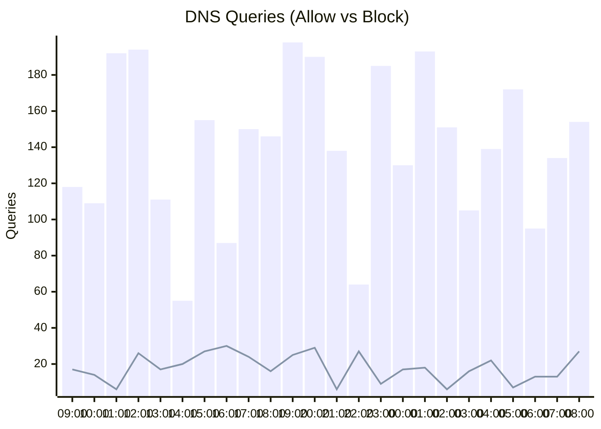

### 🛡️ Cloudflare Gateway Daily Insights
**Analyzed Period:** JST `2026-04-12 08:17 ~ 04-13 08:17`

#### 📊 Traffic Overview
- **Total Queries**: 3,797
- **Blocked**: 432 (11.4%)

#### 📈 24-Hour Query Trends (JST)

> ※ Bar = Allow, Line = Block  

#### 📍 Location Insights
| Location | Total Queries | Blocked | Block Rate | Top Blocked Domain |
| :--- | :---: | :---: | :---: | :--- |
| **Home-Network** | 1,240 | 45 | 3.6% | `doubleclick.net` |
| **Mobile-VPN** | 580 | 12 | 2.1% | `analytics.google.com` |
| **Office-PC** | 890 | 154 | 17.3% | `malware-sample.io` |

#### 🚫 Top 10 Blocked Domains (Global)
| Count | Domain |
| :--- | :--- |
| 85 | `doubleclick.net` |
| 72 | `adservice.google.com` |
| 54 | `track.evil-analytics.io` |
| 41 | `telemetry.api.unity.com` |
| 38 | `secure-pubads.g.doubleclick.net` |
| 31 | `analytics.facebook.com` |
| 25 | `stats.g.doubleclick.net` |
| 19 | `metrics.icloud.com` |
| 12 | `api-global.netflix.com` |
| 7 | `log.optimizely.com` |